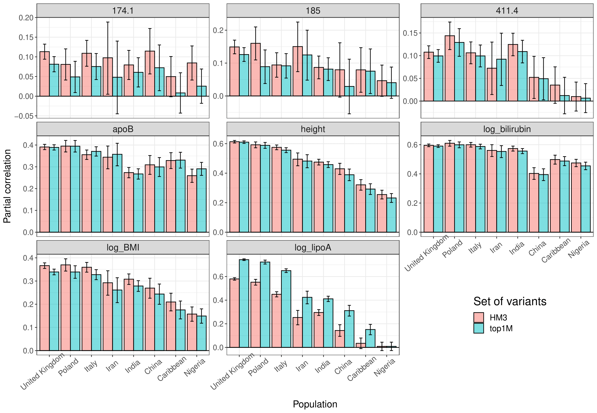
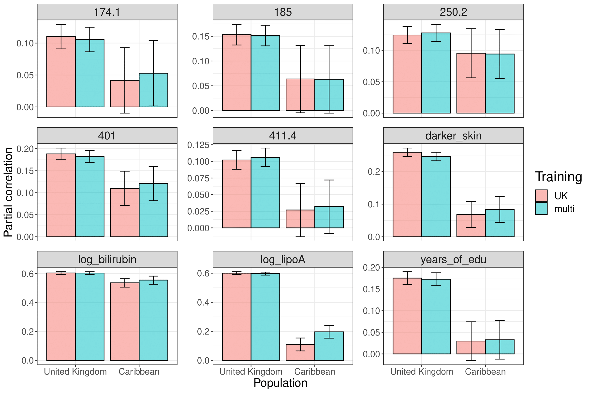

```{r setup, include=FALSE}
options(htmltools.dir.version = FALSE)
knitr::opts_chunk$set(echo = FALSE, fig.align = 'center', dev = "svg")
```


background-image: url(figures/NCRR-logos.svg)
background-size: contain
class: title-slide center middle

## High-resolution portability of 245 polygenic scores<br>when derived and applied in the same cohort

<br>

### APRS 2021

<ins>**Florian Privé**</ins>, Hugues Aschard, Shai Carmi, Lasse Folkersen, Clive Hoggart, Paul F. O’Reilly, Bjarni J. Vilhjálmsson

---

class: center middle inverse

# Introduction

---

### Major strengths of this study using the UK Biobank 

<br>

- A major concern about PGS is their transferability to other ancestries    
(e.g. bad performances in Africans for PGS trained in Europeans)

--

- UKBB is perfect to provide more detailed evidence of this concern

    - UKBB data contains 450K British, 9K South Asians, 2K East Asians and 7K Africans (including Caribbeans), and other (South and East Europe, Middle East, etc.)
    
    - many different phenotypes are available (we use 245)
    
    $\Longrightarrow$ high-resolution ancestry analysis, averaged over many traits
    
--
    
    - individuals all live in the UK and had their genetic and phenotypic information derived **in the same way**
    
    $\Longrightarrow$ circumvent potential bias when using independent studies

---

class: center middle inverse

# Methods

---

### Ancestry grouping

- We show that squared Euclidean distances on PCs are proportional to $F_{ST}$

- Then we use these distances and country of birth to define 8 (+1) ancestry groups:

```{r, out.width="85%"}

```

---

### Genetic data

<br>

- 1,040,096 HapMap3 variants (but also secondary analyses with high-quality genotyped variants or a larger set of imputed variants)

- Indidivuals used:

    1. Training based on 391,124 individuals of British ancestry<br>and testing in all 9 ancestry groups (20,000 UK + 28,254 non-UK)
    
    2. Training based on 367,063 UK + 24,061 non-UK<br>(391,124 in total $\rightarrow$ same as before)

<br>

```{r, out.width="98%"}

```

---

### Phenotypic data

- Mapped ICD10 and ICD9 codes to derive 106 phecodes (mostly diseases)

- Used other UKBB fields to also define 111 continuous and 28 binary phenotypes (so, 245 in total)

```{r, out.width="85%"}

```

---

### Predictive methods

- **Penalized regression** (efficient LASSO, https://doi.org/10.1534/genetics.119.302019) based on *individual-level* training data (genotype dosage matrix + phenotypes)

- **LDpred2-auto** (https://doi.org/10.1093/bioinformatics/btaa1029) on *summary statistics derived from the individual-level* training data (and in-sample LD matrix)

--

<br>

### Predictive accuracy

**Partial correlation** between PGS (x) and phenotype (y), adjusting for covariates (z).

Basically, regress out x and y by z to get x_eps and y_eps, and compute cor(x_eps, y_eps) $\rightarrow$ *signed* measure.

---

class: center middle inverse

# Results

---

### Lasso results in different ancestries

```{r, out.width="95%"}

```

.footnote[Percentage in figure title = squared slope (in blue) // same with LDpred2-auto instead of penalized regression or genotyped variants instead of HM3.]

---

### Drop in prediction versus distance

<br>

```{r, out.width="80%"}

```

<!-- <span class="footnote">Recall: $\text{dist}_{PC}^2 \propto F_{ST}$</span> -->

---

### Using more than HapMap3 variants?

#### "Zoomed" GWAS around top HM3 variants for Lipoprotein A 

```{r, out.width="100%"}
knitr::include_graphics("figures/zoom_log_lipoA.png")
```

---

### Using more than HapMap3 variants for prediction?

```{r, out.width="85%"}

```

.footnote[Should try using HM3 + top very high significant?]

---

### (Naively) using multiple ancestries in training

<br> 

```{r, out.width="88%"}

```

---

class: center middle inverse

# Conclusion

---

## Take-home messages


- We provide simple solutions for high-resolution ancestry inference, and use it to define 9 ancestry groups in the UK Biobank  

- We show a dramatic reduction of predictive performance in other ancestries, already within Europe, and increasing with PC distance to the training population

- This predictive reduction is as strong as what was reported in previous studies $^{[1]}$, even though PGS are derived and applied in the same cohort

- Our results are robust because we average over 245 phenotypes, run two different predictive methods and use multiple sets of variants

- Improving ancestry portability is not as straightforward as simply using a different set of variants or a multi-ancestry training

- Bonus: PGS effects for 215 phenotypes are made available 

.footnote[[1] Martin et al., *Nature Genetics* (2019); Duncan et al., *Nature Communications* (2019); Wang et al., *Nature Communications* (2020)]

---

class: center middle inverse

## Thank you for joining this session

<br/><br/>

Preprint: [bit.ly/preprint-UKBB-PGS](https://doi.org/10.1101/2021.02.05.21251061)

Slides: [bit.ly/pres-UKBB-PGS](https://privefl.github.io/UKBB-PGS/APRS2021.html)

<br/>

`r icon::fa("twitter")` [privefl](https://twitter.com/privefl) &nbsp;&nbsp;&nbsp;&nbsp; `r icon::fa("github")` [privefl](https://github.com/privefl)


.footnote[Slides created with R package [**xaringan**](https://github.com/yihui/xaringan)]


