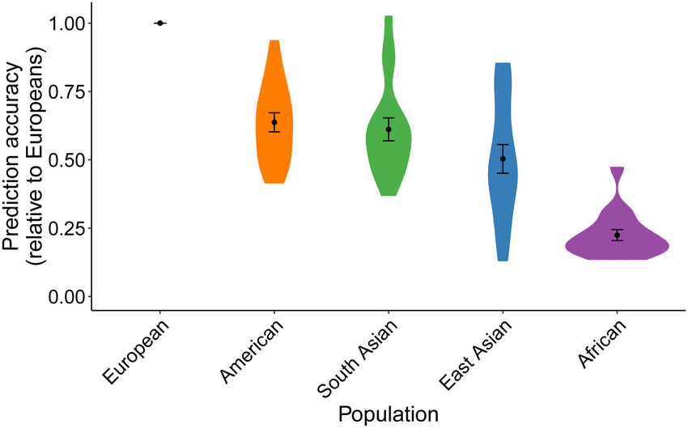

```{r setup, include=FALSE}
options(htmltools.dir.version = FALSE)
knitr::opts_chunk$set(echo = FALSE, fig.align = 'center', dev = "svg")
```


background-image: url(figures/NCRR-logos.svg)
background-size: contain
class: title-slide center middle

## Portability of 245 polygenic scores<br>when derived from the UK Biobank and applied<br>to 9 ancestry groups from the same cohort

<br>

### Personalised Medicine Network

<br>

<ins>**Florian Privé**</ins>, Hugues Aschard, Shai Carmi, Lasse Folkersen,<br>Clive Hoggart, Paul F. O’Reilly, Bjarni J. Vilhjálmsson

<br>

<br>

---

<!-- ### Introduction  -->

- **Polygenic scores (PGS)**, which aggregates information from multiple variants into a single predictor, have shown **great promise** for identifying high-risk (or low-risk) individuals for several diseases

- However, **portability** of PGS across ancestries is **concerning**  
(e.g. PGS trained using European individuals underperform in African individuals)

<br>

```{r, fig.cap="<small>Prediction accuracy relative to European ancestry individuals across 17 quantitative traits and 5 continental populations in UKBB. Figure from Martin et al. Nature Genetics (2019).</small>", out.width="70%"}

```

---

### What does our study add?

The UK Biobank data can provide more detailed evidence of this concern

- The UK Biobank data contains 450K individuals of British ancestry, but also from many other ancestries; we define **9 large ancestry groups**:
```{r, out.width="100%"}
knitr::include_graphics("figures/table1-2.JPG")
```

- there are many different phenotypes available (we use **245**)

$\Longrightarrow$ higher-resolution ancestry analysis, averaged over many traits

- individuals all live in the UK and had their genetic and phenotypic information derived **in the same way**

$\Longrightarrow$ circumvent potential bias when using independent studies

- using individual-level data makes deriving PGS highly reliable, and we use different methods: *penalized regression* and *LDpred2-auto*
    
---

### Portability across 245 phenotypes and 9 ancestry groups

```{r, out.width="95%"}
knitr::include_graphics("figures/lasso-ancestry-2.png")
```

.footnote[Percentage in figure title = squared slope (in blue) // same with LDpred2-auto instead of penalized regression or genotyped variants instead of HapMap3 variants.]

---

### Predictive performance drops with genetic distance

<br>

```{r, out.width="82%"}
knitr::include_graphics("figures/ratio-dist-2.png")
```

<!-- <span class="footnote">Recall: $\text{dist}_{PC}^2 \propto F_{ST}$</span> -->

---

### Take-home messages

- We provide simple solutions for high-resolution ancestry inference, and use them to define 9 ancestry groups in the UK Biobank  

- We show a dramatic reduction of predictive performance in other ancestries, already within Europe, and increasing with PC distance to the training population

- This predictive reduction is consistent with previous studies $^{[1]}$, even though PGS are derived and applied in the same cohort

- Our results are robust because we average over 245 phenotypes, run two different predictive methods and use multiple sets of variants

***

- PGS effects for 215 phenotypes are made available 

- Accepted in AJHG / available as medRxiv preprint

- What's next? More populations and multiple-ancestry training

.footnote[[1] Martin et al., *Nature Genetics* (2019); Duncan et al., *Nature Communications* (2019); Wang et al., *Nature Communications* (2020)]
