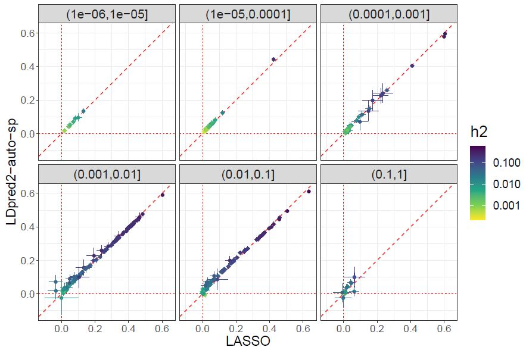

```{r setup, include=FALSE}
options(htmltools.dir.version = FALSE)
knitr::opts_chunk$set(echo = FALSE, fig.align = 'center', dev = "svg")
```

class: title-slide center middle inverse

## High-resolution portability of 240 polygenic scores<br>when derived and applied in the same cohort

<br>

### Florian Privé

---

class: center middle inverse

# Introduction

---

### Major strengths of this study using the UK Biobank 

<br>

- A major concern about PGS is their transferability to other ancestries    
(e.g. bad performances in Africans for PGS trained in Europeans)

- UKBB is perfect to provide more detailed evidence of this concern

    - UKBB data contains 450K British, 9K South Asians, 2K East Asians and 7K Africans (including Caribbeans), and other (South and East Europe, Middle East)
    
    - many different phenotypes are available (we use 240)
    
    - $\Rightarrow$ high-resolution analysis, averaged over many traits
    
    - individuals had their genetic and phenotypic information derived **in the same way**
    
    - $\Rightarrow$ circumvent potential bias when using independent studies

---

class: center middle inverse

# Methods

---

### Ancestry grouping

(Full supplementary note on this) Summary:

- We show that squared Euclidean distances on PCs are proportional to $F_{ST}$

- Then use these distances and country of birth to define 8 ancestry groups:

```{r, out.width="80%"}
knitr::include_graphics("https://privefl.github.io/predict-everything/figures/UKBB-matched-country.png")
```

---

### Genetic data

<br>

- 1,040,096 HapMap3 variants (but also secondary analyses with high-quality genotyped variants or a larger set of imputed variants)

- Training based on individuals of British ancestry and testing in all 8 ancestry groups (also try training using multiple ancestries)

<br>

```{r, out.width="98%"}

```

---

### Phenotypic data

<br>

- Mapped ICD10 and ICD9 codes to phecodes $\rightarrow$ 104 phecodes with sufficient prediction

- Used other UKBB fields to define 111 continuous and 25 binary phenotypes

    $\Rightarrow$ 111 continuous + 129 binary = **240 phenotypes**
    
<br>

Some examples:

- body measures: height, BMI, BMD, etc.

- blood biochemistry: cholesterol, vitamin D, etc.

- ECG measures

- misc

---

### Predictive methods

<br>

- Penalized regression (LASSO, https://doi.org/10.1534/genetics.119.302019) based on individual-level training data -> fast for all binary phenotypes and half of the continuous ones (take more than one day for only a few).

- LDpred2-auto (https://doi.org/10.1093/bioinformatics/btaa1029) on summary statistics derived from the individual-level training data (take about seven hours for each phenotype).

---

### Prediction accuracy

<br>

**Partial correlation** between PGS (x) and phenotype (y), adjusting for covariates (z).

Basically, regress out x and y by z to get x_eps and y_eps, and compute cor(x_eps, y_eps).

---

class: center middle inverse

# Results

---

### Lasso results in different ancestries

```{r, out.width="95%"}

```

.footnote[Percentage in figure title = squared slope (in blue) // same with LDpred2-auto instead of penalized regression or genotyped variants instead of HM3.]

---

### Drop in prediction versus distance

<br>

```{r, out.width="75%"}

```

<!-- <span class="footnote">Recall: $\text{dist}_{PC}^2 \propto F_{ST}$</span> -->

---

### Using more than HapMap3 variants?

#### "Zoomed" GWAS around top HM3 variants for Lipoprotein A 

```{r, out.width="100%"}
knitr::include_graphics("figures/zoom_log_lipoA.png")
```

---

### Using more than HapMap3 variants for prediction?

```{r, out.width="85%"}
knitr::include_graphics("figures/ldpred2-large-1.png")
```

.footnote[Should try using HM3 + top very high significant?]

---

### (Naively) using multiple ancestries in training

<br> 

```{r, out.width="88%"}
knitr::include_graphics("figures/lasso_multi_pcor-1.png")
```

---

### Comparing the two methods used

#### Similar, but LASSO is better when prediction is higher, and inversely

```{r, out.width="90%"}

```

---

class: center middle inverse

# Future work

### (started as part of this project)

---

### Using family history (LT-FH) to increase power (for GWAS)

```{r, out.width="58%"}
knitr::include_graphics("../keep4later/power_LTFH.JPG")
```

.footnote[Hujoel, M.L.A., Gazal, S., Loh, P. et al. Liability threshold modeling of case–control status and family history of disease increases association power. Nat Genet 52, 541–547 (2020).]

---

### Using LT-FH to increase power (for prediction)

```{r, out.width="90%"}
knitr::include_graphics("../keep4later/lasso_LTFH.JPG")
```

.footnote[I could use LT-FH++ (multi) to improve further in future work with Emil.]

---

### Validating inference from LDpred2-auto

```{r, out.width="82%"}
knitr::include_graphics("../keep4later/heritability.JPG")
```

.footnote[Clara gets some similar results with 500+ external sumstats.]

---

### Formula for upper prediction

```{r, out.width="75%", fig.align='right'}
knitr::include_graphics("../keep4later/upper-formula.JPG")
```

<span class="footnote"> $r^2 = \frac{h^2}{1 + (1 - r^2) \frac{M p}{N h^2}}$ </span>

---

class: center middle inverse

# That's all folks!
